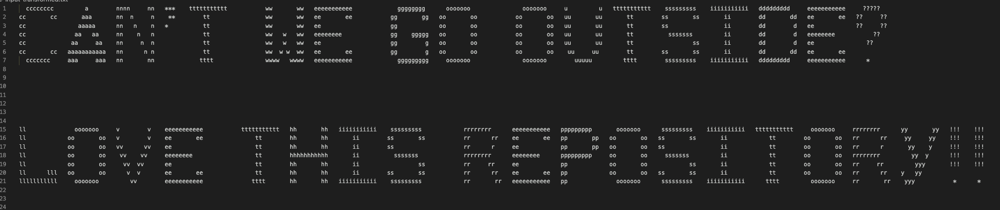

## Text Transformer

### About
    
Using text transformer cli tool, you can transformer a text input file into various formats:
- ascii-drawing
- hexadecimal
- binary

The inspiration for this project was just to do a small challenge in C++ that I thought up myself :) 

**WARNING:** some translations are **_lossy_** if input file contains incompatible data for the destination formatt. A best-effort attempt is made.

### Build-Source
If you want to build this project locally, the compiler used was clang with C++20 standard. 
```
git clone git@github.com:SummerGautier/ascii-transformer.git
clang++ -std=c++20 ./src/**/*.cpp -o transform.exe
# The executable transform.exe should result from the above commands.
```

### Usage
After building from source, the following is an example of usage for an ascii drawing:
 ```
 ./transform.exe --src my-text.txt --out destination.txt --ascii-draw
 ```

## Manual
This section goes over the supported formats and how to invoke them, as well as things to keep in mind about each translation type.
### Ascii Draw (Default)
If not formatter type is specified, ascii-draw is the default. Here is an example command:
```
 ./transform.exe --src my-text.txt --out destination.txt --ascii-draw 
 ```
**Example Input File:**

*my-text.txt*

    Can't we go outside?
    Love This Repository!!

**Example Output File:**

*destination.txt*


### Hexadecimal
Hexadecimal takes a text file and returns hexadecimal representation, preserving newlines. Example command:

```
./transform.exe --src my-text.txt --out destination.txt --hex
```
**Example Input File:**

*my-text.txt*
```
It's easy as ABC, 123!
Like & Subscribe :)
```

**Example Output File:**

*destination.txt*
```
497427732065617379206173204142432c2031323321a
4c696b65202620537562736372696265203a29
```

### Binary
Binary takes a text file and returns hexadecimal representation, preserving newlines. Example command:
```
./transform.exe --src my-text.txt --out destination.txt --hex
```
**Example Input File:**

*my-text.txt*
```
ACE
CAB
123
```

**Example Output File:**
```
01000001010000110100010100001010
01000011010000010100001000001010
001100010011001000110011
```

## Contribution
- Inside of /src/Formatter/Data there is Literals.txt, it could use more than just the alphabet.
- It would be cool to extend the ability to translate image data as well.
- Open an issue and discuss before doing work on this, please :) 